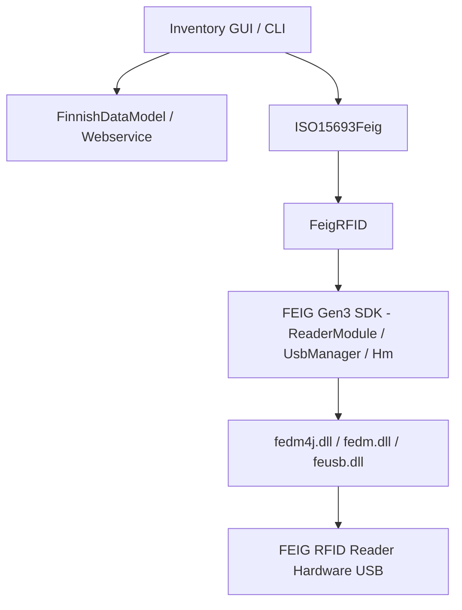

# Requirements

### Overview & Goals
The goal of this task is to upgrade the FEIG RFID SDK from legacy Gen2 (OBIDISC4J v5.6.3) to the modern FEIG SDK Gen3 (FEDM Java API v7.1.0) provided in the repository folder `FEIG.ID.SDK.Gen3.Java-v7.1.0`. This ensures compatibility with modern 64-bit Windows environments, improved USB reader communication stability, and alignment with the latest FEIG hardware revisions.

### Scope
- **In Scope**:
  - Replacing legacy JAR dependencies (`OBIDISC4J.jar`, `OBIDISC4J_API.jar`) with Gen3 JARs (`fedm-java-api-7.1.0.jar`, `fedm-funit-java-api-1.1.0.jar`, `fedm-service-java-api-11.2.1.jar`).
  - Replacing native x64 DLLs in `lib/native/x64/` with Gen3 native binaries (`fecom.dll`, `fedm.dll`, `fedm4j.dll`, `feusb.dll`, etc.).
  - Updating `pom.xml` dependency declarations.
  - Migrating `FeigRFID.java` and `ISO15693Feig.java` from `FedmIscReader` / `FedmIscTagHandler_ISO15693` to `ReaderModule` / `ThIso15693` / `UsbManager`.
  - Replacing `de.feig.FeHexConvert` with `de.feig.fedm.utility.HexConvert` in `FinnishDataModel.java` and `InventoryCallback.java`.
  - Updating `build-installer.ps1` to bundle the new JARs and native DLLs.
  - Ensuring all existing unit tests (`FinnishDataModelTest`, `WebserviceTest`) pass.
- **Out of Scope**:
  - Modifying business logic for ISO 28560 / Finnish Data Model encoding/decoding.
  - Modifying REST webservice endpoints or MySQL database communication schemas.

### Functional Requirements
- **FR-1**: The application must discover connected FEIG USB readers using `UsbManager` and establish a connection via `Connector.createUsbConnector(...)` and `ReaderModule`.
- **FR-2**: Reader configuration export and import via XML files (`copyConfigToFile`, `copyFileToConfig`) must use the Gen3 `Config` subsystem.
- **FR-3**: Tag inventory must discover ISO 15693 transponders and read memory blocks via `ThIso15693.readMultipleBlocks(...)`, delivering raw byte data to `InventoryCallback`.
- **FR-4**: USB disconnects and reconnects must be handled cleanly without crashing or leaving native resources open.
- **FR-5**: Standalone executable packaging via `build-installer.ps1` and Inno Setup must build cleanly with the new Gen3 binaries.

# Technical Design

### Current Implementation
The application currently uses the legacy FEIG Gen2 SDK (v5.6.3):
- `pom.xml` references system-scoped dependencies `OBIDISC4J.jar` and `OBIDISC4J_API.jar`.
- `lib/native/x64/` contains legacy DLLs (`OBIDISC4J.dll`, `fecom.dll`, `feusb.dll`, `feisc.dll`, `fefu.dll`, `fetcl.dll`, `fetcp.dll`, `libeay32.dll`, `msvcr110.dll`).
- `FeigRFID.java` instantiates `de.feig.FedmIscReader` and `de.feig.FeUsb` for USB discovery and connections.
- `ISO15693Feig.java` consumes `de.feig.TagHandler.FedmIscTagHandler_ISO15693` to execute block reads.
- `FinnishDataModel.java` and `InventoryCallback.java` use `de.feig.FeHexConvert` for hex conversions.

### Key Decisions
- **Decision 1**: Adopt `de.feig.fedm.ReaderModule` and `de.feig.fedm.UsbManager` as the primary reader interface. Rationale: Gen3 replaces the monolithic `FedmIscReader` with modular subsystems (`reader.hm()` for host mode inventory, `reader.config()` for XML configuration, and `UsbManager` for discovery).
- **Decision 2**: Use `de.feig.fedm.taghandler.ThIso15693` and `DataBuffer` for tag read operations. Rationale: `ThIso15693` provides typed block reading (`readMultipleBlocks`) compatible with standard ISO 15693 tags.
- **Decision 3**: Migrate utility classes to `de.feig.fedm.utility.HexConvert`. Rationale: `HexConvert` is part of `fedm-java-api-7.1.0.jar` and replaces `FeHexConvert` without introducing external dependencies.
- **Decision 4**: Update `build-installer.ps1` staging step to copy `lib/*.jar` and all Gen3 DLLs. Rationale: `jpackage` and Inno Setup require the new runtime DLLs (`fedm4j.dll`, `fedm.dll`, etc.) in the application directory.

### Proposed Changes
- **Dependency & Library Updates**:
  - Copy `FEIG.ID.SDK.Gen3.Java-v7.1.0/jar/*.jar` to `lib/`.
  - Copy `FEIG.ID.SDK.Gen3.Java-v7.1.0/windows.x64/bin/*.dll` to `lib/native/x64/`.
  - Remove deprecated Gen2 JARs and DLLs.
  - Update `pom.xml` dependencies to point to the new JARs.
- **Source Code Refactoring**:
  - `FeigRFID.java`:
    - Replace `FedmIscReader` with `ReaderModule(RequestMode.Fedm)`.
    - Implement USB scan using `UsbManager.startDiscover()` and `UsbManager.popDiscover()`.
    - Implement connect using `Connector.createUsbConnector(deviceID)` and `reader.connect(connector)`.
    - Migrate config export/import to `reader.config().transferReaderCfgToXmlFile(...)` and `reader.config().transferXmlFileToReaderCfg(...)`.
    - Refactor `tagInventory` to use `reader.hm().inventory(all)` and `reader.hm().popItem()`.
  - `ISO15693Feig.java`:
    - Migrate tag handling to `ThIso15693` (obtained via `reader.hm().createTagHandler(tagItem)`).
    - Read memory blocks via `th.readMultipleBlocks(...)` with `DataBuffer` and pass `dataBuffer.data()` to `InventoryCallback`.
  - `FinnishDataModel.java` & `InventoryCallback.java`:
    - Change imports from `de.feig.FeHexConvert` to `de.feig.fedm.utility.HexConvert`.

### Architecture Diagram

### File Structure
- `lib/fedm-java-api-7.1.0.jar` (Added)
- `lib/fedm-funit-java-api-1.1.0.jar` (Added)
- `lib/fedm-service-java-api-11.2.1.jar` (Added)
- `lib/OBIDISC4J.jar` (Removed)
- `lib/OBIDISC4J_API.jar` (Removed)
- `lib/native/x64/*.dll` (Updated with Gen3 x64 DLLs)
- `pom.xml` (Modified)
- `src/main/java/org/objectspace/rfid/feig/FeigRFID.java` (Modified)
- `src/main/java/org/objectspace/rfid/feig/ISO15693Feig.java` (Modified)
- `src/main/java/org/objectspace/rfid/feig/package-info.java` (Modified)
- `src/main/java/org/objectspace/rfid/FinnishDataModel.java` (Modified)
- `src/main/java/org/objectspace/rfid/library/inventory/InventoryCallback.java` (Modified)
- `build-installer.ps1` (Modified)

### Risks & Mitigations
- **Native DLL load failure at runtime**: Ensure all dependent DLLs (`fedm.dll`, `fedm4j.dll`, `feusb.dll`, `fecom.dll`, `feudp.dll`, `fetls.dll`) are in `PATH` / Java library path / installer staging folder.
- **API behavior divergence in TagHandler**: Verify `readMultipleBlocks` parameters and return buffers match the expected block sizing and offset behavior.

# Testing

### Validation Approach
Automated compilation checks, unit tests, and installer build packaging will be run to verify the migration.

### Key Scenarios
- **Compilation Check**: Run `javac -encoding UTF-8 -cp "lib/*;lib/ext/*" ...` to verify all Java files compile cleanly against the Gen3 API without legacy references.
- **Unit Test Execution**: Run `TestRunner` to execute all tests in `FinnishDataModelTest` and `WebserviceTest`, verifying data model decoding, CRC checksums, and hex conversions.
- **Build & Packaging Verification**: Run `build-installer.ps1` to ensure JAR creation, runtime staging, and jpackage app-image creation succeed with the new Gen3 dependencies.

### Test Changes
- Verify existing tests in `src/test/java/org/objectspace/rfid/` continue to pass without regressions.
- Ensure test runner classpath uses the new Gen3 JAR files in `lib/`.

# Delivery Steps

### ✓ Step 1: Update dependencies and native libraries for FEIG Gen3 SDK
FEIG Gen3 SDK JARs and native runtime binaries are integrated into the repository and configured in Maven.

- Copy `fedm-java-api-7.1.0.jar`, `fedm-funit-java-api-1.1.0.jar`, and `fedm-service-java-api-11.2.1.jar` from `FEIG.ID.SDK.Gen3.Java-v7.1.0/jar/` to `lib/`.
- Replace legacy DLLs in `lib/native/x64/` with the new Gen3 native binaries from `FEIG.ID.SDK.Gen3.Java-v7.1.0/windows.x64/bin/` (`fecom.dll`, `fedm.dll`, `fedm4j.dll`, `feusb.dll`, `feisp.dll`, `feudp.dll`, `fetls.dll`, `feble.dll`, `fedm-service.dll`, `fedm-service4j.dll`, `fedm-funit.dll`, `fedm-funit4j.dll`).
- Remove obsolete Gen2 artifacts (`OBIDISC4J.jar`, `OBIDISC4J_API.jar`, old `OBIDISC4J.dll`, etc.).
- Update `pom.xml` dependencies and descriptions to reference the new Gen3 JAR files.

### ✓ Step 2: Migrate FeigRFID and ISO15693Feig to Gen3 ReaderModule and ThIso15693
Reader connection management, configuration exchange, and ISO 15693 tag inventory operations utilize the FEIG Gen3 API.

- Refactor `src/main/java/org/objectspace/rfid/feig/FeigRFID.java` to use `de.feig.fedm.ReaderModule`, `de.feig.fedm.UsbManager`, `de.feig.fedm.Connector`, and `de.feig.fedm.RequestMode`.
- Implement device discovery and connection via `UsbManager.startDiscover()` / `popDiscover()` and `Connector.createUsbConnector()`.
- Update XML configuration transfer using `reader.config().transferReaderCfgToXmlFile()` and `reader.config().transferXmlFileToReaderCfg()`.
- Refactor `src/main/java/org/objectspace/rfid/feig/ISO15693Feig.java` to perform tag inventory with host mode (`reader.hm().inventory()`) and interact with `de.feig.fedm.taghandler.ThIso15693` to read block data.
- Update `package-info.java` documentation to reflect the Gen3 SDK.

### ✓ Step 3: Replace FeHexConvert utility usages across data models and callbacks
All legacy `FeHexConvert` usages are replaced with `HexConvert` or standard Java utilities across data models and callbacks.

- Update `src/main/java/org/objectspace/rfid/FinnishDataModel.java` to use `de.feig.fedm.utility.HexConvert` (or standard Java hexadecimal formatting).
- Update `src/main/java/org/objectspace/rfid/library/inventory/InventoryCallback.java` to replace `FeHexConvert` with `HexConvert`.
- Verify data model serialization, CRC checks, and webservice payload formatting remain fully backwards-compatible.

### ✓ Step 4: Update build scripts, compile application, and execute test suite
Installer packaging scripts are updated and the entire test suite passes without compilation or runtime errors.

- Update `build-installer.ps1` to stage the new Gen3 JAR files and copy the updated native x64 DLLs into the distribution directory.
- Verify `installer.iss` file references for bundling the portable distribution and installer executable.
- Compile the application sources using Java 17 and execute the complete test suite (`TestRunner` including `FinnishDataModelTest` and `WebserviceTest`).